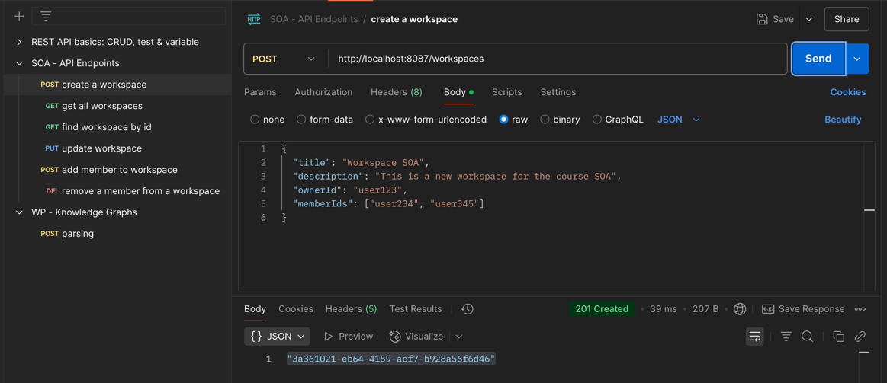
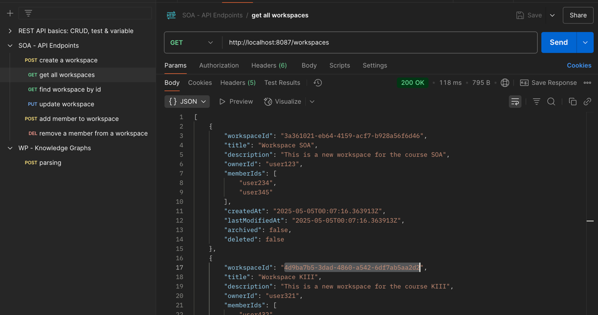
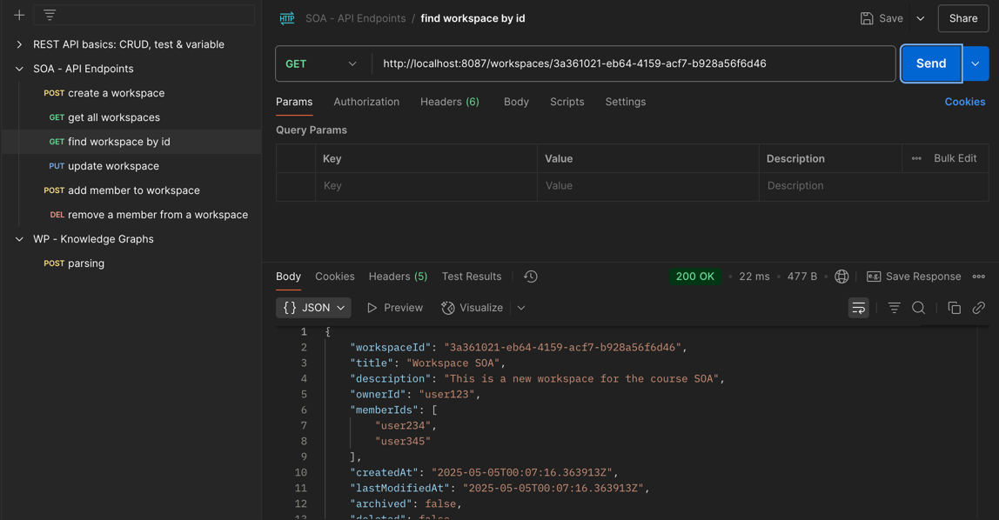
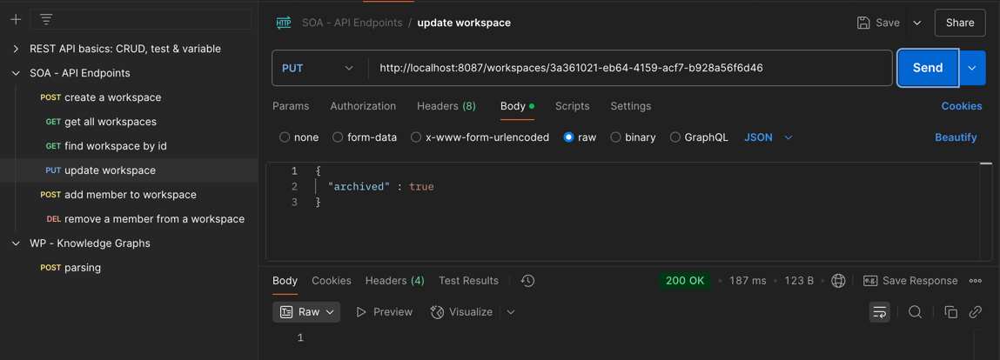
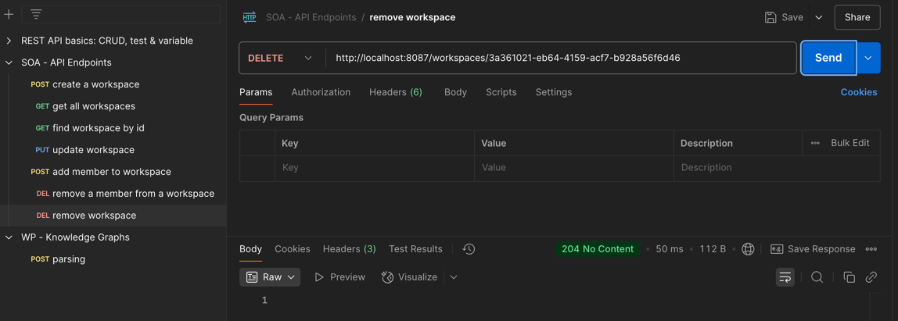
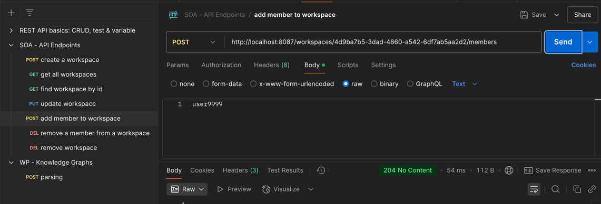
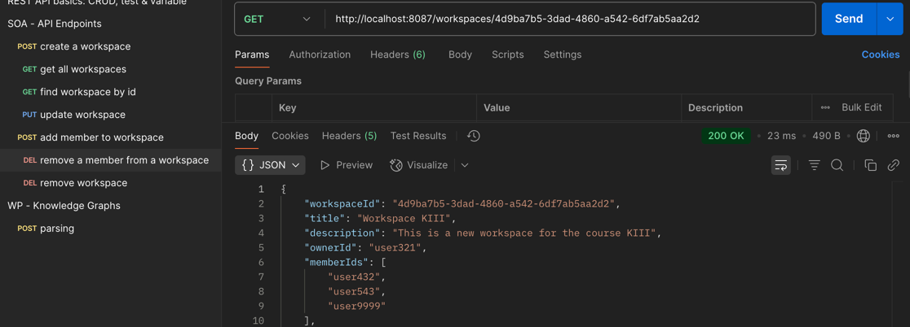

# 📘 Workspace REST API Documentation

Base URL: `http://localhost:8087/workspaces`

---

## ➕ Create Workspace

**POST** `/workspaces`

---

## 📂 Get All Workspaces

**GET** `/workspaces`

---

## 📂 Get Workspace by ID

**GET** `/workspaces/{workspaceId}`

---

## ✏️ Update Workspace

**PUT** `/workspaces/{workspaceId}`

---

## 🗑️ Delete Workspace

**DELETE** `/workspaces/{workspaceId}`

> ❗ Requires the workspace to be archived first.

---

## ➕ Add Member to Workspace

**POST** `/workspaces/{workspaceId}/members`

*Note: Make sure the string is not wrapped in quotes (JSON-style) or it will be stored incorrectly.*

---

## ❌ Remove Member from Workspace

**DELETE** `/workspaces/{workspaceId}/members/{memberId}`

